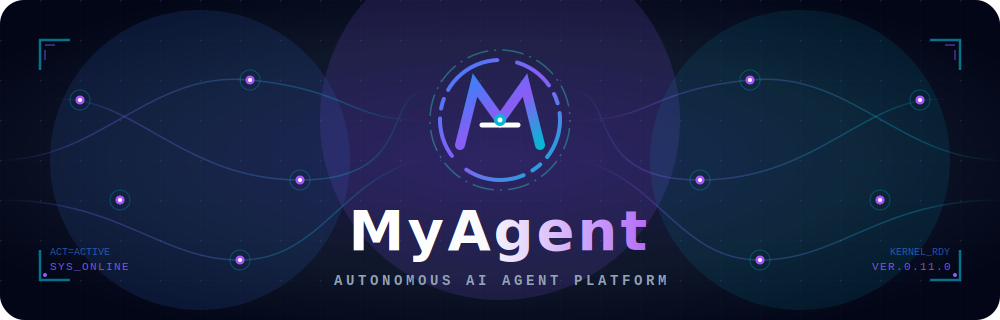
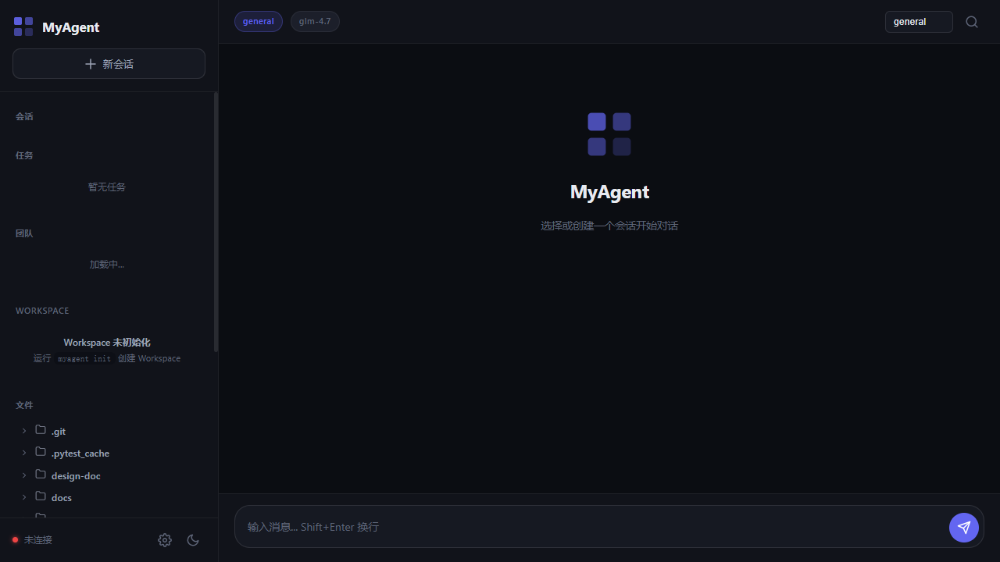
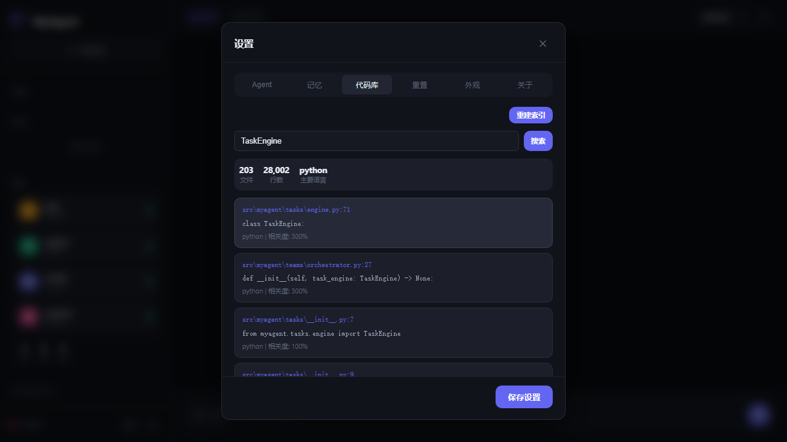
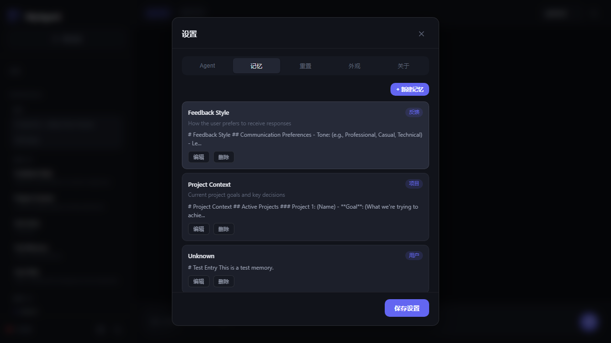

<p align="center">
  
</p>

<p align="center">
  <strong>Autonomous AI Agent with Multi-Channel Gateway</strong></p>

<p align="center">
  <a href="LICENSE"></a>
  
  
  
  
</p>

<p align="center">
  <a href="README.zh-CN.md">简体中文</a>
</p>

**MyAgent** is an autonomous AI agent platform that connects to the messaging channels you already use. It features a powerful Gateway for multi-platform messaging, a TUI for terminal enthusiasts, and a Web UI for browser-based interaction.

Supported platforms: **Feishu/Lark, Slack, Discord, Telegram, DingTalk, WeCom, Weixin, QQ, Matrix, Webhook**.

## Features

- **Multi-Channel Gateway Foundation** — Platform adapters, session isolation, and permission hooks for Telegram, Discord, Slack, Feishu, and more
- **TUI Workbench** — Setup-aware terminal UI with status sidebar, command palette, slash commands, and modal approvals
- **Web UI** — Workbench-style browser UI with grouped navigation, command palette, tool detail sidebar, task/team snapshots, review cards, and real-time WebSocket chat
- **Multi-LLM Support** — 40+ Providers (Intl + China): Anthropic (Claude 4.6/4.5), OpenAI (GPT-5.5/5/4.5), DeepSeek (V4 Pro/V4 Flash/V3/R1), Gemini (3.1 Pro/3 Flash/2.5 Pro), xAI (Grok 4/3), Qwen 3.6, Ollama, OpenRouter, Zhipu/Zhipu-CN, Moonshot/Moonshot-CN, MiniMax/MiniMax-CN, Alibaba/Alibaba-CN, HuggingFace, NVIDIA, Arcee, Xiaomi, Baidu ERNIE, iFlytek Spark, ByteDance Doubao, Tencent Hunyuan, Cohere, SiliconFlow
- **Context Compression** — Automatic conversation compaction with AutoCompactor
- **Session Management** — Per-user, per-group, per-thread sessions with persistent bindings
- **Tool Calling** — Bash, Code Interpreter (Python sandbox), file edit, web search, image analysis, Git operations
- **Permission System** — Inline approval requests in Telegram and Web UI with tool_use_id tracking
- **GitHub Integration** — Webhook-based PR/Issue analysis and auto-comments with server-side secret validation
- **Deployment Toolkit** — Docker image, compose stack, health checks, Prometheus metrics, structured JSON logging, and Helm Chart
- **Security** — JWT authentication for Web UI, path-restricted file access, WebSocket session isolation, webhook signature verification

## Screenshots

### Web UI



### Web UI - Codebase Search



### Web UI - Memory Management



## Quick Start

```bash
# Install
pip install myagent

# Quick setup for first boot
myagent init --quick

# Verify missing pieces and next step
myagent doctor

# Recommended local entry: TUI
myagent --tui

# Or launch the Web UI
myagent web --port 8000
```

Open http://localhost:8000 in your browser.

Notes:
- `myagent init` remains the full interactive wizard.
- `myagent init --quick` creates the base workspace, config templates, and `.env` scaffold.
- When setup is incomplete, both TUI and Web show `Setup Required` with the next suggested action.

### Web Workbench Highlights

- Use the left-side workbench navigation to switch between `Chat`, `Tasks`, `Files`, `Workspace`, and `Team`
- Press `Ctrl+K` to open the command palette and jump to common actions
- Use slash commands like `/plan`, `/agent`, `/model`, `/session`, `/setup`, and `/doctor`
- Click tool cards, tasks, sessions, or files to inspect details in the right sidebar
- Approving a task now enters the visible `Task -> Team -> Review` workflow, with live snapshot polling and review summary cards
- Failed or cancelled tasks can be reset with a retry action, then approved again for a fresh execution pass
- When the task pane is empty, the latest task snapshot can be restored back into the workbench with a restore action
- Review cards now split `deliverables`, `issues`, and `suggestions` into separate sections for faster inspection
- The task view now includes a lightweight team summary so execution load and completion counts stay visible
- Task snapshots now include an execution timeline so member assignment, tool activity, and review transitions stay visible
- The TUI task panel can now consume task snapshots and surface progress, active agents, latest timeline event, and review summary
- Phase 5 branding begins with shared workbench naming and brand theme tokens across the Web shell and TUI header
- Phase 5 batch 2 upgrades the welcome screen and empty states with a clearer hero, recommended actions, and stronger task-entry guidance
- Phase 5 batch 3 upgrades tool execution into a unified card system with summaries, status chips, and linked result cards by `tool_use_id`
- Phase 5 batch 4 improves narrow-screen usability with a mobile view chip, horizontal workbench navigation, and clearer full-width detail sidebars
- Phase 5 batch 5 upgrades the session control bar with instant agent/model switching feedback, a live session summary line, and a reconnect path that keeps the active session state in sync

## Documentation

- **[Getting Started](docs/GETTING_STARTED.md)** — First-time setup guide
- **[Production Deployment](docs/PRODUCTION.md)** — Docker, systemd, SSL, monitoring
- **[Configuration Reference](docs/CONFIGURATION.md)** — Complete config options

## CLI Commands

```bash
myagent init              # Interactive setup wizard
myagent init --quick      # Generate a minimal local-ready setup
myagent doctor            # Diagnose setup status and suggest next action
myagent web               # Start Web UI server
myagent --tui             # Start TUI workbench
myagent --version         # Show version
```

## Configuration

All user configuration lives in `~/.myagent/`:

```
~/.myagent/
├── config.yaml          # Agent settings (model, context, memory)
├── gateway.yaml         # Gateway platforms, sessions
├── .env                 # API keys and secrets
├── sessions/            # Session storage
├── logs/                # Log files
└── workspace/           # Agent workspace
```

### Environment Variables

```bash
# LLM (International)
ANTHROPIC_API_KEY=sk-ant-...
OPENAI_API_KEY=sk-...
DEEPSEEK_API_KEY=sk-...
ZHIPU_API_KEY=...
MOONSHOT_API_KEY=...
MINIMAX_API_KEY=...
XAI_API_KEY=...
GEMINI_API_KEY=...
DASHSCOPE_API_KEY=...
HF_API_KEY=...
NVIDIA_API_KEY=...
ARCEE_API_KEY=...
XIAOMI_API_KEY=...

# LLM (China Domestic - API Key NOT interchangeable)
ZHIPU_CN_API_KEY=...
MOONSHOT_CN_API_KEY=...
MINIMAX_CN_API_KEY=...
DASHSCOPE_CN_API_KEY=...

# Gateway
FEISHU_APP_ID=cli_...
FEISHU_APP_SECRET=...
SLACK_BOT_TOKEN=xoxb-...
TELEGRAM_BOT_TOKEN=...
DISCORD_BOT_TOKEN=...

# GitHub Integration
GITHUB_TOKEN=ghp_...
GITHUB_APP_ID=...
GITHUB_WEBHOOK_SECRET=...

# MyAgent
MYAGENT_HOME=/custom/path
MYAGENT_MODEL_DEFAULT=anthropic/claude-sonnet-4
```

## Docker

```bash
docker build -t myagent .
docker run -d \
  -p 8000:8000 \
  -v myagent-data:/app/data \
  -e ANTHROPIC_API_KEY=$ANTHROPIC_API_KEY \
  myagent
```

Notes:
- The default image entrypoint runs the Web UI only.
- TUI is intended for local terminal use, not as a container default process.
- For multi-service local deployment, use `docker compose up -d web` or `docker compose --profile bot up -d`.

### Kubernetes (Helm)

```bash
helm install myagent ./deploy/helm/myagent \
  --set myagent.apiKeys.anthropic="your-api-key" \
  --set myagent.provider="anthropic"
```

See [deploy/helm/myagent/README.md](deploy/helm/myagent/README.md) for full Helm configuration.

## Development

```bash
git clone https://github.com/wjt0321/MyAgent.git
cd myagent
pip install -e ".[dev]"
pytest
```

## Architecture

```
┌─────────────┐     ┌─────────────┐     ┌─────────────┐
│   Feishu    │     │    Slack    │     │   Discord   │
└──────┬──────┘     └──────┬──────┘     └──────┬──────┘
       │                   │                   │
       └───────────────────┼───────────────────┘
                           │
                    ┌──────▼──────┐
                    │   Gateway   │
                    │  (WebSocket)│
                    └──────┬──────┘
                           │
              ┌────────────┼────────────┐
              │            │            │
       ┌──────▼──────┐ ┌───▼────┐ ┌────▼─────┐
       │    TUI      │ │ Web UI │ │  Engine  │
       │  (Terminal) │ │(Browser│ │  (LLM)   │
       └─────────────┘ └────────┘ └──────────┘
```

## Security

MyAgent connects to real messaging platforms. Treat inbound messages as **untrusted input**.

- **Default**: Unknown senders receive a pairing request
- **Recommended**: Use allowlists and sandbox tools
- **Never commit**: `.env` files or API keys to version control

## License

MIT License — see [LICENSE](LICENSE) for details.

## Acknowledgments

Inspired by [Hermes Agent](https://github.com/NousResearch/hermes-agent), [OpenClaw](https://github.com/openclaw/openclaw), [Claude Code](https://github.com/anthropics/claude-code), and [OpenHarness](https://github.com/HKUDS/OpenHarness).
